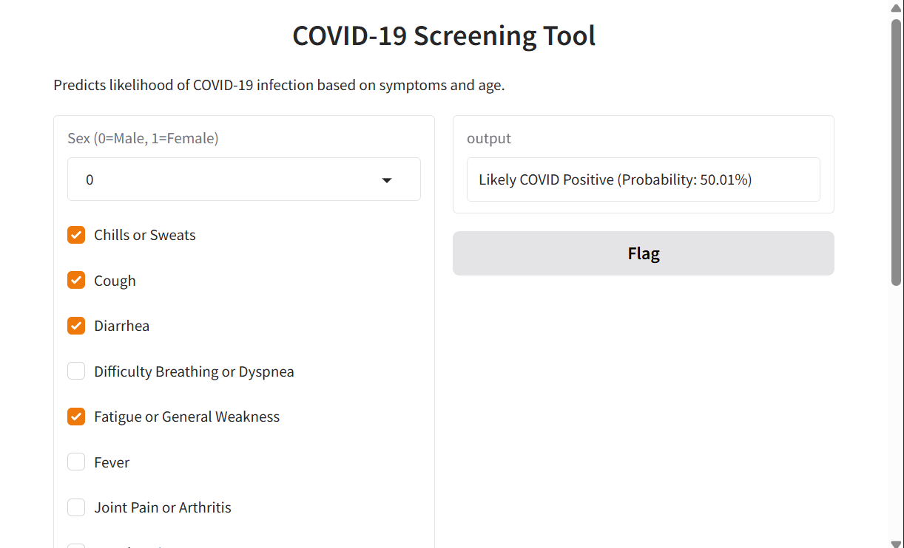

# COVID-19 Screening Tool

## Overview
In this project we developed a **machine learning screening tool** to predict potential COVID-19 cases based on patient demographics and symptoms. The tool is designed for **early detection and public health triage**, not as a diagnostic test.

---



---
## Data Description and Preprocessing
- **Original dataset**: 109,927 rows, 47 features  
- **Target variable**: COVID-19 test results (positive / negative)  
- **Data cleaning**:
  - Removed ambiguous results
  - Dropped columns with >90% missing values
  - Dropped free-text and low-variance features
- **Missing values**:
  - Age: replaced negative/missing values with median
  - Symptoms: missing assumed as 0 (not present)

---

## Exploratory Data Analysis (EDA)
- **Age distribution**: ~75% of patients were ≤34 years  
- **Sex distribution**:
  - Males: 34,100 tested, ~8.9% positive  
  - Females: 18,618 tested, ~7.0% positive  
- **Feature selection**: 15 statistically significant features retained


---

## Feature Engineering
- Age scaled using StandardScaler  
- Attempted clustering of features into respiratory, gastrointestinal, and neurological groups — later excluded as it reduced model performance

---

## Model Development
- Dataset split into **training and test sets**  
- Addressed class imbalance with **SMOTE**  
- Models evaluated:
  - Random Forest  
  - Logistic Regression  
  - Gradient Boosting  
  - XGBoost  
  - SGDClassifier  
  - SVC (commented out due to long runtime)

### Choosing Algorithm
- **Logistic Regression** selected:
  - Recall ≈ 49% (detects nearly half of true positives)  
  - Accuracy ≈ 73%  
  - F1-score ≈ 0.22  
  - Balance between interpretability, stability, and performance  

**Performance Table**:

| Model                 | Accuracy | Recall | Precision | F1-score |
|-----------------------|---------|--------|-----------|----------|
| Logistic Regression   | 0.73    | 0.49   | 0.14      | 0.22     |
| Random Forest         | 0.74    | 0.44   | 0.14      | 0.21     |
| Gradient Boosting     | 0.75    | 0.48   | 0.15      | 0.23     |
| XGBoost               | 0.73    | 0.46   | 0.14      | 0.22     |
| SGDClassifier         | 0.78    | 0.40   | 0.16      | 0.23     |

---

## Model Deployment
The final **Logistic Regression model** was deployed using **Gradio**:  
- Users input demographic and symptom data  
- Outputs real-time **screening prediction**  


---

## Ethical Considerations
- **False negatives**: ~50% of positive cases missed  
- **False positives**: ~2,500 healthy individuals flagged  
- **Use**: Screening tool, not diagnostic  
- **Equity & privacy**: Regular audits recommended; data anonymized  

---

## Conclusion
A screening tool was developed using **15 clinically relevant features**. The Logistic Regression model provides a **balance between interpretability and recall**, aiding early detection efforts while highlighting the need for confirmatory testing.

---

## Usage
1. Install dependencies from `requirements.txt`  
2. Launch Gradio app:
```bash
python app.py
